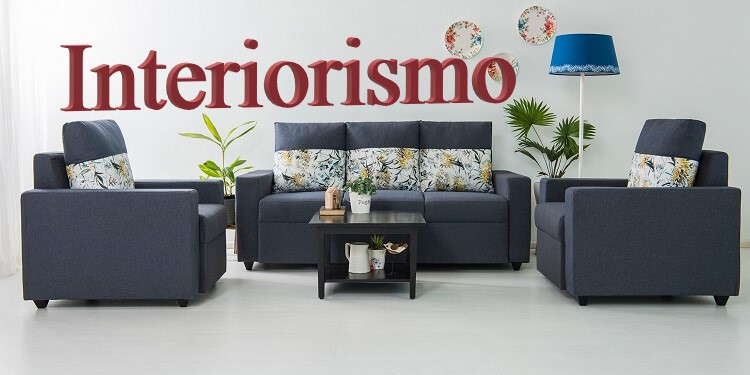

# Interiorsmo

 This AR app would help user to decide which furniture fits their surrounding without actually placing it there.

<a href ="https://drive.google.com/file/d/1QsWLU6SPlZVdGRHwdc12YHWFMoUruuEl/view?usp=sharing">Demo video of the app</a> 

<a href ="https://drive.google.com/file/d/1QsWLU6SPlZVdGRHwdc12YHWFMoUruuEl/view?usp=sharing">Demo video of the app</a> 
In this project, a lot of model for each type of furniture is added that used can choose from and check that model in their surrounding.

<h3>Tech stack :</h3>
  &#9672 Unity 
  &#9672 C# 
  &#9672 ARCore

  
  <n3> Working</h3>
  
